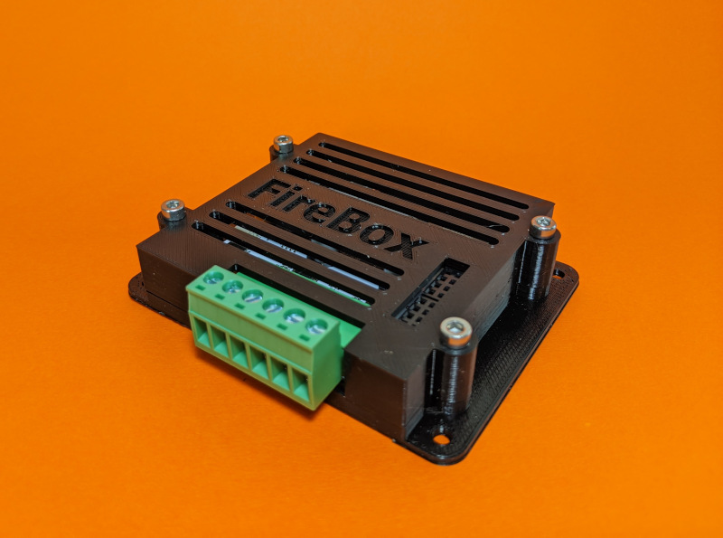

# Overview
Welcome to the documentation home for Wasatch Scale Models. Here you'll find documentation for all of our products and services. 

## About Wasatch Scale Models
Wasatch Scale Models is a new manufacturer of model railroad products. Started by David Cutting in June 2020, WSM currently specializes in electronics for all scales of model railroading. WSM is an offshoot of the now-defunct Cutting Edge Scale Models (CESM), which specialized in N and HO scale 3D printed locomotives and signalling products. 

Over the next year, WSM plans to re-introduce and expand the original CESM product line, as well as expanding its own line of DCC hardware.